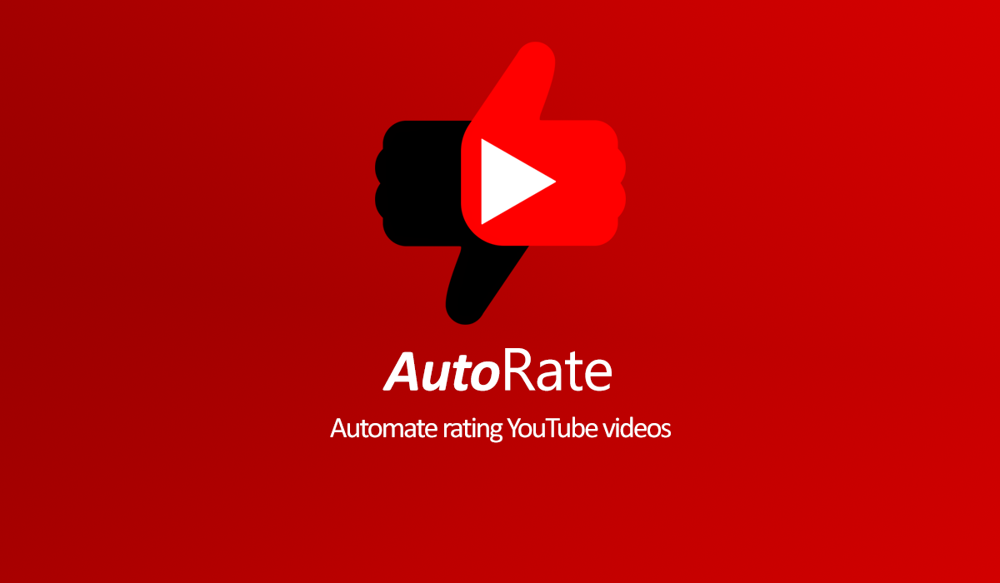

# AutoRate - Automate YouTube Videos Rating

AutoRate is a browser extension that helps your automate rating the youtube videos you watch.
This extension is made for people who are too lazy or forgetful to rate videos, never bother liking, disliking a video again.

## Features

This extension helps you do these things:

- Ability to select a default behaviour to rate all watched videos.

- Ability to select a behaviour to rate videos from a specific channels.

- Ability to specify a percentage of the video to watch before reacting.
